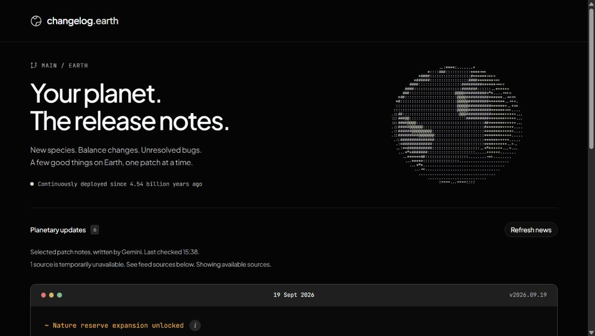
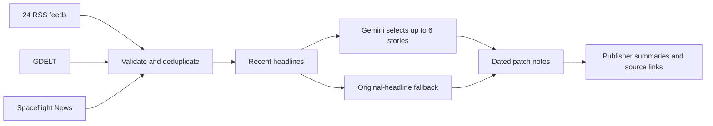

<div align="center">

# changelog.earth

### Your planet. The release notes.

New species. Balance changes. Unresolved bugs.<br>
A few good things on Earth, one patch at a time.

[](LICENSE)
[](#run-locally)
[](package.json)

[Live site](https://www.changelog.earth) · [Run locally](#run-locally) · [How it works](#how-it-works) · [Contribute](#contributing)

</div>



## An unofficial changelog for Earth

What if the news read like a game's patch notes?

```diff
+ New cat spawned
* Elder chimp vision patched
~ Airport map rework underway
```

changelog.earth collects recent reporting and turns selected headlines into short planetary updates. Open a story's info button for the original headline, publisher summary and source link. The examples above illustrate the editorial style; the feed changes as new stories arrive.

- **A small edition.** Up to six stories, prioritising discoveries, conservation wins and useful progress.
- **Reporting you can trace.** Original links, publishers and dates stay attached to every update.
- **A living terminal.** A rotating ASCII Earth, dated panels and compact source stacks.
- **Visible fallbacks.** Original headlines when Gemini is unavailable; cached stories and feed failures are labelled.

## Run locally

Requires **Node.js 22.13 or newer** and npm. Windows, macOS and Linux are supported.

```sh
git clone https://github.com/byalex33/changelog.earth.git
cd changelog.earth
npm ci
```

Copy `.env.example` to `.env.local`, then add your Gemini API key:

```dotenv
GEMINI_API_KEY=your_key_here
GEMINI_MODEL=gemini-3.5-flash
```

```sh
npm run dev
```

Open **http://localhost:5173**. Without a key, the app still fetches news and shows original headlines. Restart the server after changing environment variables. Keep the key server-side; never use a `NEXT_PUBLIC_` variable for it.

## How it works



The current directory covers **26 feeds across 18 source organisations**. The server keeps stories from the last seven days, checks healthy sources again after 15 minutes, and can reuse previously fetched stories for up to 24 hours during outages. Refresh checks happen when the API is requested, rather than through a background scheduler.

Gemini receives headlines and categories. It selects and rewrites them, while source URLs and dates come from the validated feed data. Publisher summaries are displayed separately. Generated labels can be wrong, so the linked reporting remains the reference. GDELT timestamps indicate indexing time rather than publication time.

On Vercel, generated editions stay fresh in the CDN for 15 minutes and can be served for another hour while refreshing in the background. Fallback headlines are cached for one minute. Empty editions are not cached. Feed requests time out after eight seconds; the first uncached edition can still take longer while Gemini writes it, with an animated ASCII signal showing progress.

Server-side caching and request coalescing are also in memory, per instance. They are not a global rate or spending limit.

## Make it yours

| Change | File |
| --- | --- |
| Add or adjust an RSS feed | [`lib/rss-feeds.mjs`](lib/rss-feeds.mjs) |
| Tune story selection and patch-note wording | [`lib/changelog.mjs`](lib/changelog.mjs) |
| Adjust freshness, filtering and source caching | [`lib/news.mjs`](lib/news.mjs) |
| Change the ASCII globe | [`components/ascii-earth.tsx`](components/ascii-earth.tsx) and [`lib/ascii-earth.mjs`](lib/ascii-earth.mjs) |
| Edit the page and theme | [`app/page.tsx`](app/page.tsx) and [`app/globals.css`](app/globals.css) |
| Change story popouts and the source directory | [`components/news-details.tsx`](components/news-details.tsx) |

Built with **React 19, TypeScript, Tailwind CSS 4 and Vinext**, with a Cloudflare Workers development runtime and a Next.js build for Vercel. Gemini uses the REST API directly. The interface uses shadcn/ui, Radix, Motion and Hugeicons.

## Checks

```sh
node scripts/check-news.mjs
node scripts/check-changelog.mjs
node scripts/check-earth.mjs
```

These cover feed parsing, validation, deduplication, cache and outage behaviour, generated-output validation, source integrity, and globe geometry. The checks use Node's built-in assertions and mocked requests.

`npm run lint` runs ESLint. The starter currently has lint findings in existing UI code; a passing lint badge is intentionally not claimed.

## Deploy to Vercel

Import this GitHub repository in Vercel. The included `vercel.json` selects Next.js, installs with `npm ci`, and builds with `next build --webpack`. Add `GEMINI_API_KEY` as a server-side environment variable and optionally set `GEMINI_MODEL`, then deploy. The news function allows up to 120 seconds for upstream fetches and generation.

For analytics, create a website in [Tracwell](https://tracwell.app/docs/browser-sdk), use its **private** collection mode, and add the production domain to its allowed domains. Set `NEXT_PUBLIC_TRACWELL_PROJECT_KEY` to the public browser project key before building. No analytics script is loaded when this value is absent. Never use a Tracwell server key in this variable.

Add your custom domain in the Vercel project settings and apply the DNS records Vercel provides at your DNS host.

## Build for Cloudflare

```sh
npm run build
npm start
```

The build produces a Cloudflare Worker under `dist/server`; `npm start` previews it locally through Wrangler. To host it on your own Cloudflare account, configure your Worker and secrets, then deploy the generated Worker configuration. The default news feed does not require D1 or R2.

Set `GEMINI_API_KEY` as a production secret and optionally set `GEMINI_MODEL`. Do not commit credentials. Local hosting metadata is optional and is excluded from the public repository.

## Contributing

Small, focused pull requests are welcome. For a bug, include what happened, what you expected, and steps to reproduce it. For a feed suggestion, include its URL and explain why its reporting fits the project.

Run the relevant checks before opening a pull request. Keep original source links intact, preserve uncertainty in the reporting, and avoid jokes about suffering. UI changes should include a screenshot and work with keyboard navigation and reduced motion.

## License and credits

Project code is available under the [MIT license](LICENSE). Third-party components retain their own notices:

- [BeUI motion components](components/motion/LICENSE)
- [shadcn styles](vendor/shadcn-tailwind-4.13.0.LICENSE.md)
- [Sites Vite plugin](build/sites-vite-plugin.LICENSE)
- [JetBrains Mono](public/fonts/JetBrainsMono-OFL.txt) and [Plus Jakarta Sans](public/fonts/PlusJakartaSans-OFL.txt), under the SIL Open Font License

News articles, publisher summaries, names and logos belong to their respective owners. The software license does not relicense that content. This project is not affiliated with the publishers it links to.
