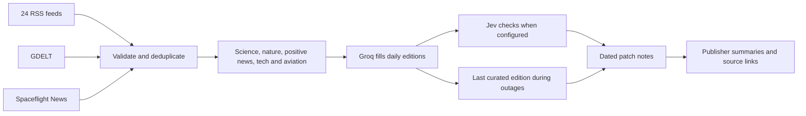

<div align="center">

# changelog.earth

### Your planet. The release notes.

New species. Balance changes. Unresolved bugs.<br>
A few good things on Earth, one patch at a time.

[](LICENSE)
[](#run-locally)
[](package.json)

[Live site](https://www.changelog.earth) · [Run locally](#run-locally) · [How it works](#how-it-works) · [Contribute](#contributing)

</div>


## An unofficial changelog for Earth

What if the news read like a game's patch notes?

```diff
+ New cat spawned
* Elder chimp vision patched
~ Airport map rework underway
```

changelog.earth collects recent reporting and turns selected headlines into short planetary updates. Open a story's info button for the original headline, publisher summary and source link. The examples above illustrate the editorial style; the feed changes as new stories arrive.

- **Daily editions.** Aim for 3–6 worthwhile stories per publication day, prioritising discoveries, conservation wins and useful progress. Quiet days can have fewer.
- **Reporting you can trace.** Original links, publishers and dates stay attached to every update.
- **Follow via RSS.** Subscribe at `/feed.xml` for the latest 100 published patch notes, with source links and stable IDs. The feed refreshes on the same 15-minute schedule as the homepage and never generates AI drafts.
- **A living terminal.** A rotating ASCII Earth, dated panels and compact source stacks.
- **Loading feedback.** A mint Orbit indicator from [loading.dev](https://loading.dev/spinners/orbit) appears while a page is loading, respects reduced motion, and never delays the cached content.
- **Saved editions during outages.** Groq selects stories and writes patch titles. Failed requests leave the saved archive intact; raw headlines never fill the gap.

## Run locally

Requires **Node.js 22.13 or newer** and npm. Windows, macOS and Linux are supported.

```sh
git clone https://github.com/byalex33/changelog.earth.git
cd changelog.earth
npm ci
```

Copy `.env.example` to `.env.local`, then add your Groq API key:

```dotenv
GROQ_API_KEY=your_key_here
GROQ_MODEL=openai/gpt-oss-120b
# Optional: enables Jev editorial and title checks through Vercel AI Gateway
AI_GATEWAY_API_KEY=your_gateway_key
```

```sh
npm run dev
```

Open **http://localhost:5173**. Without a Groq key, the app serves the saved archive but cannot select new stories. Restart the server after changing environment variables. Keep the key server-side. Configure the same variables in Vercel for production.

Set `AI_GATEWAY_API_KEY` in `.env.local` and in the Vercel project's server environment to enable Jev. Without it, collection keeps the existing Groq-only behavior. Jev uses the native `POST https://ai-gateway.vercel.sh/v1/evaluate` API with model `typesafe-ai/jev`; no extra SDK is needed. Vercel lists promotional free pricing until **September 25, 2026**. Check [current Gateway pricing](https://vercel.com/ai-gateway/models/jev) and your account budget before enabling it; this integration does not enforce a free-only spending cap.

## How it works



The current directory covers **26 feeds across 18 source organisations**. The server keeps stories from the last seven days, checks healthy sources again after 15 minutes, and can reuse previously fetched stories for up to 24 hours during outages. Refresh checks happen when the API is requested, rather than through a background scheduler.

Groq receives headlines from relevant categories. The editorial prompt excludes politics, war, crime, lawsuits, sports disputes and outrage stories. It selects and rewrites them, while source URLs and dates come from the validated feed data. Publisher summaries are displayed separately. Generated labels can be wrong, so the linked reporting remains the reference. GDELT timestamps indicate indexing time rather than publication time.

The homepage is generated with a complete edition before deployment. Next.js serves that cached HTML immediately, including to first-time visitors, and regenerates it in the background on visits after 15 minutes. Failed or empty regeneration keeps the previous page; an initial build without a valid edition fails instead of publishing an empty feed. The browser no longer waits for /api/news. The separate API still caches generated editions in the CDN for 15 minutes and allows an hour of stale serving during refreshes. Previously curated editions served during outages are cached for one minute. Empty editions are not cached. Feed requests time out after eight seconds. News and AI latency is paid during builds and background regeneration, rather than on the normal visitor loading path. Local development renders on demand; use a production build to measure caching.

Server-side caching and request coalescing are also in memory, per instance. They are not a global rate or spending limit.

## Make it yours

| Change | File |
| --- | --- |
| Add or adjust an RSS feed | [`lib/rss-feeds.mjs`](lib/rss-feeds.mjs) |
| Tune story selection and patch-note wording | [`lib/changelog.mjs`](lib/changelog.mjs) |
| Adjust freshness, filtering and source caching | [`lib/news.mjs`](lib/news.mjs) |
| Change the ASCII globe | [`components/ascii-earth.tsx`](components/ascii-earth.tsx) and [`lib/ascii-earth.mjs`](lib/ascii-earth.mjs) |
| Edit the page and theme | [`app/page.tsx`](app/page.tsx) and [`app/globals.css`](app/globals.css) |
| Change story popouts and the source directory | [`components/news-details.tsx`](components/news-details.tsx) |

Built with **React 19, TypeScript, Tailwind CSS 4 and Vinext**, with a Cloudflare Workers development runtime and a Next.js build for Vercel. Groq uses the REST API directly. The interface uses shadcn/ui, Radix, Motion and Hugeicons.

## Checks

```sh
node scripts/check-news.mjs
node scripts/check-changelog.mjs
node scripts/check-earth.mjs
node scripts/check-feed.mjs
node scripts/check-jev.mjs
```

These cover feed parsing, validation, deduplication, cache and outage behaviour, generated-output validation, source integrity, and globe geometry. The checks use Node's built-in assertions and mocked requests.

`npm run lint` runs ESLint. Current checks pass with one advisory about the small external favicon images.

## Deploy to Vercel

Import this GitHub repository in Vercel. The included `vercel.json` selects Next.js, installs with `npm ci`, and builds with `next build --webpack`. Add `GROQ_API_KEY` as a server-side environment variable, optionally set `GROQ_MODEL`, and set `AI_GATEWAY_API_KEY` to enable Jev, then deploy. The news function allows up to 120 seconds for upstream fetches, generation and review.

For analytics, create a website in [Tracwell](https://tracwell.app/docs/browser-sdk), use its **private** collection mode, and add the production domain to its allowed domains. Set `NEXT_PUBLIC_TRACWELL_PROJECT_KEY` to the public browser project key before building. No analytics script is loaded when this value is absent. Never use a Tracwell server key in this variable.

Add your custom domain in the Vercel project settings and apply the DNS records Vercel provides at your DNS host.

## Build for Cloudflare

```sh
npm run build
npm start
```

The build produces a Cloudflare Worker under `dist/server`; `npm start` previews it locally through Wrangler. To host it on your own Cloudflare account, configure your Worker and secrets, then deploy the generated Worker configuration. The default news feed does not require D1 or R2.

Set `GROQ_API_KEY` as a production secret and optionally set `GROQ_MODEL`. Do not commit credentials. Local hosting metadata is optional and is excluded from the public repository.

## Contributing

Read the [contribution guide](CONTRIBUTING.md) for setup, checks and pull request expectations. Everyone taking part should follow the [code of conduct](CODE_OF_CONDUCT.md).

Small, focused pull requests are welcome. For a bug, include what happened, what you expected, and steps to reproduce it. For a feed suggestion, include its URL and explain why its reporting fits the project.

Run the relevant checks before opening a pull request. Keep original source links intact, preserve uncertainty in the reporting, and avoid jokes about suffering. UI changes should include a screenshot and work with keyboard navigation and reduced motion.

## License and credits

Project code is available under the [MIT license](LICENSE). Third-party components retain their own notices:

- [BeUI motion components](components/motion/LICENSE)
- [shadcn styles](vendor/shadcn-tailwind-4.13.0.LICENSE.md)
- [Sites Vite plugin](build/sites-vite-plugin.LICENSE)
- [JetBrains Mono](public/fonts/JetBrainsMono-OFL.txt) and [Plus Jakarta Sans](public/fonts/PlusJakartaSans-OFL.txt), under the SIL Open Font License

News articles, publisher summaries, names and logos belong to their respective owners. The software license does not relicense that content. This project is not affiliated with the publishers it links to.


### Edition archive

`data/editions.json` retains published stories by their source publication date. New selections fill up to six places per day without replacing earlier entries. Exact source URLs and original headlines are deduplicated; saved source URLs and original headlines are checked before generation. There is no automatic expiry of archived days.

The **Archive daily editions** GitHub Actions workflow collects the live curated API twice daily, at 00:23 and 12:23 UTC, and commits additions. It can also be run manually. It requires no AI secrets in GitHub. On Vercel, the app reads that public archive with a 15-minute cache and keeps its previous generated page if GitHub is unavailable. Local development can use its bundled archive offline. Only saved selections are shown to visitors. AI generation runs only for the archive collector, using the API’s archive query. The job commits the result before visitors can see it. GitHub can delay scheduled runs; failures remain visible in Actions.

Run `node scripts/check-archive.mjs` to check daily limits, duplicate prevention, retention and cold-outage behavior. To capture a local edition, set `EDITION_URL=http://localhost:5176/api/news` before running `node scripts/archive-editions.mjs`.

Publication safety: normal page and API reads return committed archive stories without calling feeds or AI. Only the archive collector requests candidate editions. New headlines receive one Groq pass for eligibility and game-style titles, followed by Jev when configured; a failed pass prevents publication. Archived title corrections carry a revision number so an older cached copy cannot undo them. Run `node scripts/check-publication.mjs` to check this behavior.

Worldwide editorial scope: the selector and title writer share the policy in `lib/editorial-policy.mjs`. Stories must show significance beyond a local audience, regardless of their publisher or country. The writer receives only original headlines and records a versioned `worldwide` assessment with its reason. Only assessed, eligible stories appear on the homepage and public API. Excluded stories remain in the archive but do not consume daily publication slots. Buffed/Nerfed labels describe demonstrated improvements or reductions; plans and prototypes retain their uncertainty. Style changes require an archive review before publication.
`node scripts/check-collection.mjs` checks collection failure reporting and bounded rate-limit retries. Groq calls retry once when Retry-After is at most 60 seconds, within a shared 70-second call deadline. Each run sends at most 24 new headlines, without summaries or archive history. One low-reasoning call assesses relevance and writes titles with a 3,000-token output ceiling. Accepted and rejected results are saved to avoid repeat reviews. Story details come from publisher text rather than AI expansion. Successful provider responses log actual input/output token usage. Collection errors fail the archive job; a completed empty selection is logged separately. A run date does not change the source publication dates shown on the site.

Jev reviews Groq-accepted candidates against the same worldwide editorial policy and checks each patch title against its original headline. It sends only headlines, proposed titles and kinds, with at most 24 candidates per request and a shared 20-second deadline. Both probabilities must reach 0.8, an initial threshold that has not been calibrated on this archive. Jev can reject a candidate but cannot promote a Groq rejection. Scores are saved in each reviewed story's `jev` field and survive archive corrections. Malformed responses, rate limits and timeouts fail collection without publishing unchecked drafts. Existing published stories are not retroactively reviewed. Rejected stories remain archived to avoid repeat calls. `node scripts/check-jev.mjs` covers the integration using mocked API responses.
