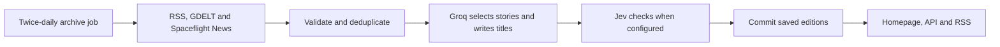

<div align="center">

# changelog.earth

### Your planet. The release notes.

New species. Balance changes. Unresolved bugs.<br>
A few good things on Earth, one patch at a time.

[](LICENSE)
[](#run-locally)
[](package.json)

[Live site](https://www.changelog.earth) · [Run locally](#run-locally) · [How it works](#how-it-works) · [Contribute](#contributing)

</div>


## An unofficial changelog for Earth

What if the news read like a game's patch notes?

```diff
+ New cat spawned
* Elder chimp vision patched
~ Airport map rework underway
```

changelog.earth collects recent reporting and turns selected headlines into short planetary updates. Open a story's info button for the original headline, publisher summary and source link. The examples above illustrate the editorial style; the feed changes as new stories arrive.

- **Daily editions.** Aim for 3–6 worthwhile stories per publication day, prioritising discoveries, conservation wins and useful progress. Quiet days can have fewer.
- **Reporting you can trace.** Original links, publishers and dates stay attached to every update.
- **Follow via RSS.** Subscribe at `/feed.xml` for the latest 100 published patch notes, with source links and stable IDs. The feed refreshes on the same 15-minute schedule as the homepage and never generates AI drafts.
- **A living terminal.** A rotating ASCII Earth, dated panels and compact source stacks.
- **Loading feedback.** A mint Orbit indicator from [loading.dev](https://loading.dev/spinners/orbit) appears while a page is loading, respects reduced motion, and never delays the cached content.
- **Saved editions during outages.** Groq selects stories and writes patch titles. Failed requests leave the saved archive intact; raw headlines never fill the gap.

## Run locally

Requires **Node.js 22.13 or newer** and npm. Windows, macOS and Linux are supported.

```sh
git clone https://github.com/byalex33/changelog.earth.git
cd changelog.earth
npm ci
```

Copy `.env.example` to `.env.local`, then add your Groq API key:

```dotenv
GROQ_API_KEY=your_key_here
GROQ_MODEL=openai/gpt-oss-120b
# Optional: enables Jev editorial and title checks through Vercel AI Gateway
AI_GATEWAY_API_KEY=your_gateway_key
```

```sh
npm run dev
```

Open **http://localhost:5173**. Without a Groq key, the app serves the saved archive but cannot select new stories. Restart the server after changing environment variables. Keep the key server-side. Configure the same variables in Vercel for production.

Set `AI_GATEWAY_API_KEY` in `.env.local` and in the Vercel project's server environment to enable Jev. Without it, collection uses Groq alone. Check [Gateway pricing](https://vercel.com/ai-gateway/models/jev) and your account budget before enabling it; this integration does not enforce a spending cap.

## How it works



The **Archive daily editions** GitHub Actions workflow collects stories at 00:23 and 12:23 UTC. It requests drafts from `/api/news?archive`, then commits them to [`data/editions.json`](data/editions.json). Normal homepage, API and RSS requests read saved editions without calling feeds or AI. Failed collection leaves published stories intact.

Groq assesses headlines for worldwide relevance and writes game-style patch titles. Jev checks eligibility and title accuracy when configured. Original source links, dates and publisher summaries remain attached. Generated labels can be wrong, so the linked reporting remains the reference. GDELT dates indicate indexing time rather than publication time.

On Vercel, Next.js serves the homepage as cached HTML and regenerates it on visits after 15 minutes. Failed or empty regeneration keeps the previous page; an initial build without a valid edition fails. Local development renders on demand, so use a production build to measure caching.

See [collection, archive and caching details](docs/architecture.md) for the editorial rules, outage behaviour and provider limits.

## Make it yours

| Change | File |
| --- | --- |
| Add or adjust an RSS feed | [`lib/rss-feeds.mjs`](lib/rss-feeds.mjs) |
| Tune story selection and patch-note wording | [`lib/changelog.mjs`](lib/changelog.mjs) |
| Adjust freshness, filtering and source caching | [`lib/news.mjs`](lib/news.mjs) |
| Change the ASCII globe | [`components/ascii-earth.tsx`](components/ascii-earth.tsx) and [`lib/ascii-earth.mjs`](lib/ascii-earth.mjs) |
| Edit the page and theme | [`app/page.tsx`](app/page.tsx) and [`app/globals.css`](app/globals.css) |
| Change story popouts and the source directory | [`components/news-details.tsx`](components/news-details.tsx) |

Built with **React 19, TypeScript, Tailwind CSS 4 and Vinext**, with a Cloudflare Workers development runtime and a Next.js build for Vercel. Groq uses the REST API directly. The interface uses shadcn/ui, Radix, Motion and Hugeicons.

## Checks

Run `npm run lint` for ESLint. The [contribution guide](CONTRIBUTING.md#check-your-changes) lists the focused checks for parsing, editorial rules, publication, caching, RSS and globe geometry. They use Node's built-in assertions and mocked provider requests.

## Deploy to Vercel

Import this GitHub repository in Vercel. The included `vercel.json` selects Next.js, installs with `npm ci`, and builds with `next build --webpack`. Add `GROQ_API_KEY` as a server-side environment variable, optionally set `GROQ_MODEL`, and set `AI_GATEWAY_API_KEY` to enable Jev, then deploy. The news function allows up to 120 seconds for upstream fetches, generation and review.

For analytics, create a website in [Tracwell](https://tracwell.app/docs/browser-sdk), use its **private** collection mode, and add the production domain to its allowed domains. Set `NEXT_PUBLIC_TRACWELL_PROJECT_KEY` to the public browser project key before building. No analytics script is loaded when this value is absent. Never use a Tracwell server key in this variable.

Add your custom domain in the Vercel project settings and apply the DNS records Vercel provides at your DNS host.

## Build for Cloudflare

```sh
npm run build
npm start
```

The build produces a Cloudflare Worker under `dist/server`; `npm start` previews it locally through Wrangler. To host it on your own Cloudflare account, configure your Worker and secrets, then deploy the generated Worker configuration. The default news feed does not require D1 or R2.

Set `GROQ_API_KEY` as a production secret and optionally set `GROQ_MODEL`. Do not commit credentials. Local hosting metadata is optional and is excluded from the public repository.

## Contributing

Read the [contribution guide](CONTRIBUTING.md) for setup, checks and pull request expectations. Everyone taking part should follow the [code of conduct](CODE_OF_CONDUCT.md).

## License and credits

Project code is available under the [MIT license](LICENSE). Third-party components retain their own notices:

- [BeUI motion components](components/motion/LICENSE)
- [shadcn styles](vendor/shadcn-tailwind-4.13.0.LICENSE.md)
- [Sites Vite plugin](build/sites-vite-plugin.LICENSE)
- [JetBrains Mono](public/fonts/JetBrainsMono-OFL.txt) and [Plus Jakarta Sans](public/fonts/PlusJakartaSans-OFL.txt), under the SIL Open Font License

News articles, publisher summaries, names and logos belong to their respective owners. The software license does not relicense that content. This project is not affiliated with the publishers it links to.
